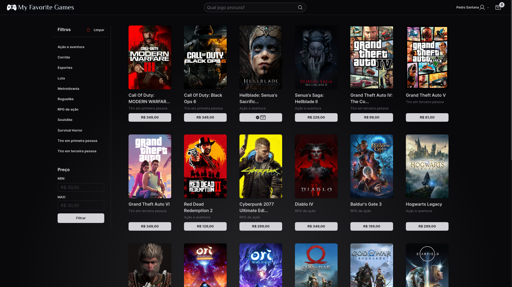

#  My Favorite Games API

O [My Favorite Games](https://github.com/santanap2/my-favorite-games) é um projeto pessoal fictício de um e-commerce para compra de jogos online.

Toda a aplicação é alimentada por essa API, desenvolvida exclusivamente para essa aplicação, visando suprir suas necessidades.

[Acesse agora o My Favorite Games](https://myfavgames.vercel.app/)

 

## Tecnologias utilizadas
### Principais:
  - Node.Js;
  - Typescript;
  - Express.Js;
  - PostgreSQL;
  - Prisma ORM;
  - Hash via Bcrypt;
  - Variáveis de ambiente com .env.
    
### Desenvolvimento:
  - Docker: containerização do banco de dados;
  - ESLint: legibilidade e organização do código;
  - Arquitetura: camadas model, service e controller desenvolvidas com programação orientada a objetos. 

## Rotas

### Carrinho

##### /add-to-cart
Adiciona um item ao carrinho em uma requisição POST.

##### /buy-one-item
Remove todos os items do carrinho e adiciona somente um item ao carrinho em uma requisição PUT.

##### /get-user-cart
Retorna o carrinho do usuário com sessão ativa em uma requisição GET

##### /remove-from-cart
Remove um item do carrinho do usuário com sessão ativa em uma requisição PUT.

##### /empty-cart
Remove todos os itens do carrinho do usuário com sessão ativa em uma requisição PUT.

### Categorias

##### /create-category
Adiciona uma nova categoria em uma requisição POST.

##### /create-categories
Adiciona várias categorias em uma requisição POST.

##### /get-categories
Retorna todas as categorias em uma requisição GET.

### Avaliações

##### /add-evaluation
Adiciona uma avaliação de um usuário para um jogo em uma requisição POST.

##### /get-game-evaluations/id
Retorna todas as avaliações de um jogo específico em uma requisição GET.

##### /get-user-evaluations
Retorna todas as avaliações feitas por um usuário em uma requisição GET.

##### /get-user-evaluation/id
Retorna os dados de uma avaliação específica de um usuário em uma requisição GET.

##### /update-evaluation
Atualiza os dados de uma avaliação do usuário em uma requisição PUT.

### Favoritos

##### /add-or-remove-favorite
Dependendo se um jogo está favoritado ou não, adiciona ou remove um jogo aos favoritos do usuário com sessão ativa em uma requisição PUT.

##### /get-all-favorites
Retorna todos os favoritos do usuário com sessão ativa em uma requisição GET.

### Jogos

##### /add-game
Adiciona um jogo ao banco de dados em uma requisição POST.

##### /add-many-games
Adiciona muitos jogos ao banco de dados em uma requisição POST.

##### /get-games
Retorna todos os jogos adicionados em uma requisição GET.

##### /get-game/id
Retorna todos os dados de um jogo específico em uma requisição GET.

##### /get-game-by-name/name
Retorna todos os dados de um jogo específico procurando-o pelo nome em uma requisição GET.

### Login

##### /login
Faz o login do usuário baseando-se credenciais de email e senha em uma requisição POST.

##### /logout
Faz o logout do usuário com sessão ativa em uma requisição POST.

### Pedidos

##### /create-order
Cria um pedido de um usuário com sessão ativa em uma requisição POST.

##### /get-orders
Retorna todos os pedidos do usuário com sessão ativa em uma requisição GET.

##### /get-order/id
Retorna todos os dados de um pedido específico do usuário com sessão ativa em uma requisição GET.

##### /get-bought-products
Retorna todos os produtos comprados em todos os pedidos do usuário com sessão ativa em uma requisição GET.

### Usuário

##### /get-user-by-email/email
Retorna os dados de um usuário em uma requisição GET.

##### /register
Cria um novo usuário na base de dados em uma requisição POST.

##### /update-user
Atualiza os dados do usuário com sessão ativa em uma requsição PUT.
